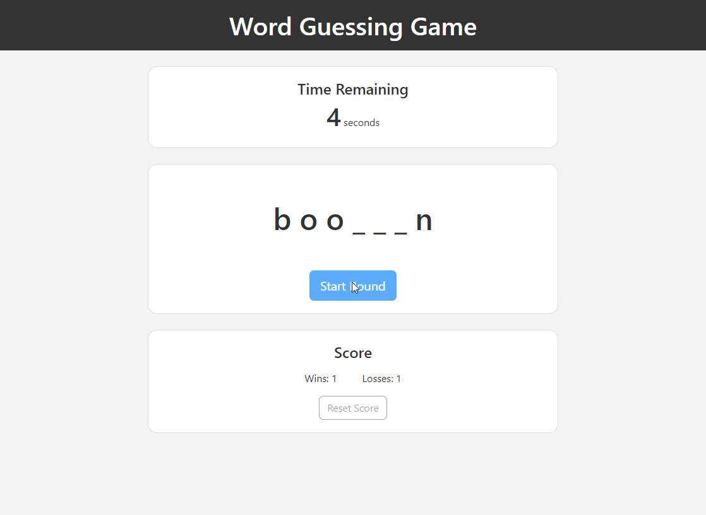

# **Word Guessing Game**

&nbsp;
## **Description**
Word Guessing Game is a JavaScript powered letter to word guessing game played in browser. The website is created with HTML and styled with CSS and Bootstrap component classes. The game functionality is implemented in JavaScript.

A game player, upon initiating a round is presented with a number of blanks spaces matching the number of characters in the word to guess. Using the keyboard the player can enter guessed letters that will be shown if correct. The player has a time limit of 10 seconds to determine the complete word before losing the round. The game will keep score of wins and losses and display those stats to the player. The player can reset their game stats. 

&nbsp;
## **Application**

&nbsp;
## **External Resources**
Uses
- Bootstrap v4.6 for styling elements